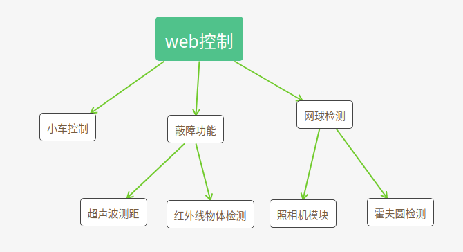
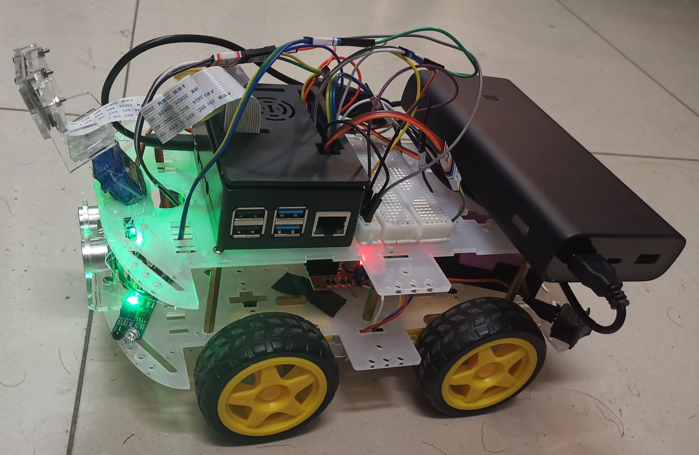
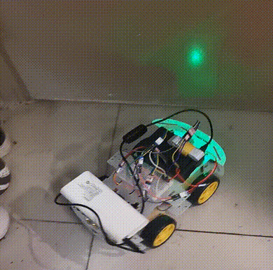
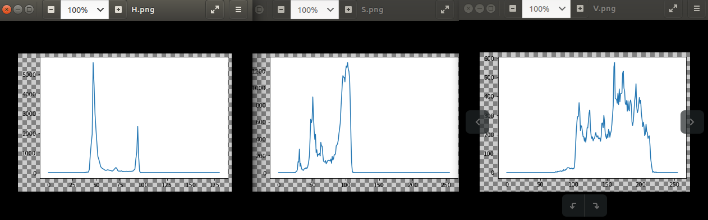
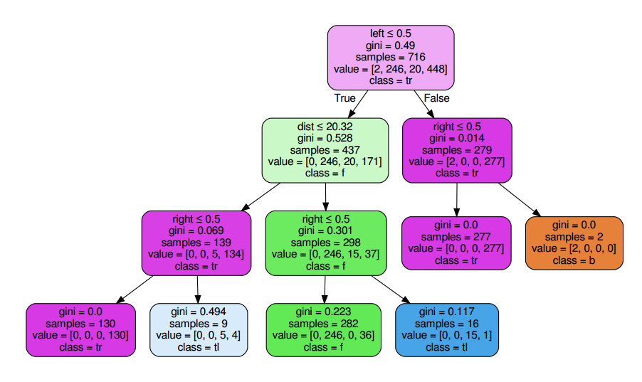
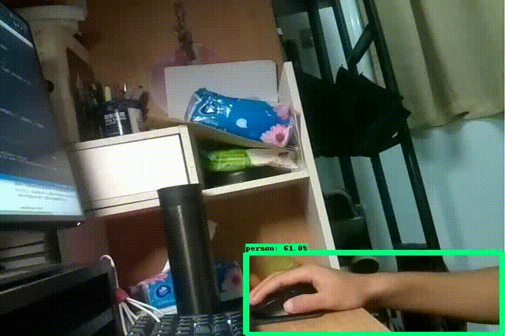

# 树莓派小车

### 主要内容

1. 通过web控制智能小车
2. 基于超声波和红外线的自动蔽障
3. 使用霍夫圆算法实现对网球的追踪

### 总体设计

目标是通过web进行选择，然后针对小车进行相应的操作。

### 3.实验成果

[源程序github地址](https://github.com/Wlgls/smart_car)

### 4.详细设计

#### 器件

1. 树莓派4
2. 超声波一个
3. 红外线一个
4. L298N电机驱动器
5. CSI摄像头一个

#### 准备工作

##### 小车基础

小车的硬件基础就是L298N直流电机控制小车运动，超声波测距和红外线寻障。

对于这三个硬件，通过Python的GPIO库来控制，对三个物品分别定义一个类，然后放在相应的py文件中即`Car.py, Ultrasound.py, Infrared.py`,依据以下的三个程序编写程序即可。

* [L298N电机工作原理](https://blog.csdn.net/yyandad/article/details/103828020?utm_medium=distribute.pc_relevant_t0.none-task-blog-BlogCommendFromMachineLearnPai2-1.edu_weight&depth_1-utm_source=distribute.pc_relevant_t0.none-task-blog-BlogCommendFromMachineLearnPai2-1.edu_weight)

* [HC-SR04工作原理](https://blog.csdn.net/ling3ye/article/details/51407328)
* [红外线工作原理](https://blog.csdn.net/chinacqzgp/article/details/108445785)

##### 摄像机模块

在本次实践中，使用Python的picamera模块对摄像头进行操作。

同时还实现了通过socket模块实现了通过UDP传输协议将树莓派中拍摄的照片实时的传输到本机上，之所以使用UDP协议，而不是TCP协议是因为UDP占用资源更少，实时性强。（但是这一功能仅用于早起的调试，后期已舍弃）

后续实现了在web上观看视频的功能。

尽管相比于使用UDP照相机的FPS变小了但是，这也保证了可以多用户进行访问。

###### 细节设计

由于照相机的拍摄是一个while循环，单线程无法将拍摄的照片传输到web上，为了可以在web上传输，使用了线程这一操作，对线程间的通信使用全局变量。其中子线程仅获取照相机获得图片，并将这一图片放在全局变量空间中，这样web端只需要获得这一全局变量即可。

##### 模块设计

##### 自动蔽障

自动蔽障基于超声波和红外线，主要是为了防止小车运行时装上障碍物。其思想十分简单，通过超声波获取距离，通过红外线获取左右是否有障碍物，然后控制小车运行即可。其主要实现在Shelter.py文件中。

##### 网球检测

网球的检测使用了霍夫圆检测的技术，霍夫圆技术就是将将过原图某一个点的所有圆映射到一个三维abr空间曲线上:
$$
a = x - r \cos\theta \\
b = y - r \sin\theta 
$$
然后通过对比这些曲线的交点，当交点超过一定的数量时，就可以当做是一个圆。

###### 详细设计

因为霍夫圆对噪声是十分敏感的，为了排除一部分的噪声，我将图片转换到HSV空间。通过检测网球这一模型的在各个模型的范围，然后在所有检测的圆中，寻找在这一范围内的圆形。这就保证了很大的可能为所要检测的网球。

检测后对小车的操作需要在照相机这一线程中，这是因为，霍夫圆的检测时间比照相机的要快一些，所以，为了避免矛盾，就将检测过程放在了照相机处理过程中，同时为了控制这一功能的开关，建立一个新的全局变量tennisrun控制。

#### 其余内容

##### 决策树

在最开始实现蔽障时，我甚至想要使用决策树，然后我通过手动控制获取了大量样本，然后通过这些样本进行训练，但是我得到的结果不甚理想，并且不宜解释。

 

我认为可能是样本代表性太低的结果，因为对于整个样本集，总共只有左转，右转，前进和后退四种可能。且对于这几种可能，小车处于的场景及其类似。而且明明简单的问题我显然把它复杂化了。。。。最终还是只是使用了逻辑简单处理。

##### haar分类器

在进行网球检测的时候，我先使用的是霍夫环检测和HSV空间法两种方式。但是两种方式都不尽人意，后面我甚至考虑了使用haar分类器来进行网球的检测，尽管Haar分类器更多的是用于人脸识别，但是根据Opencv官网的介绍，它也适用于单一正样本的识别。

然而。。。我收集了400张背景样本，然后经过预处理，删去重复，模糊图片大概只剩下一百多张，再加上由于宿舍空间有限，其背景变化率不够明显。。。所以无论如何修改参数，最终只能训练出一层。。。。这应该是样本量太少的锅，可是大批量样本训练深层网络，这会导致检测时间过长，这没有意义啊。

最终选择了霍夫圆+HSV结合，并且调低了相机的位置，尽量使其照向地面，从而排除一定的噪声。

##### tensorflow物品识别

只是想要尝试一下，没有进行过多的操作，调用了模型直接检测，尽量选择速度快的模型`'ssdlite_mobilenet_v2_coco'  `，虽然会降低一部分的精确度和识别率。

